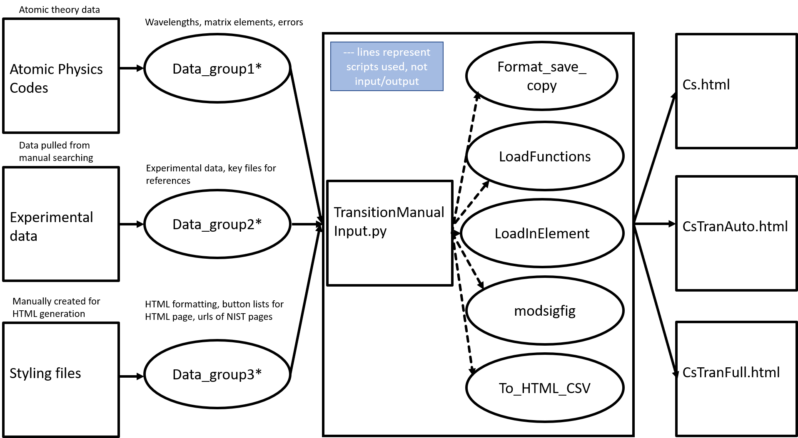

# Welcome to Atom web portal documentation
This site provides documentation on how to generate the HTML pages for the Portal for High-Precision Atomic Data and Computation. The site can be reached at  
<https://www1.udel.edu/atom>

#Flowchart

